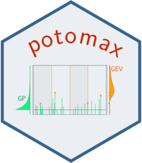

<a href="https://irsn.github.io/potomax/"></a>

<!-- README.md is generated from README.Rmd. Please edit that file -->

# Scope

**potomax** is a R package funded by IRSN Behrig. 

It is devoted to Extreme Value analysis and merges the two
classical approaches *POT* (Peaks Over Threshold) and *block
MAXima*. In both cases we may consider that the observations are
related in some way to a *Poisson-GP marked process* i.e., a marked
Poisson process with the marks following the Generalised Pareto (GP)
distribution. While this framework is classical for POT, it is also
convenient for block maxima with arbitrary block durations. This
approach allows to censor the block maxima that are too small to be
considered as extreme, as is often needed for one-year blocks. It also
allows to cope with heterogeneous data as met when using historical
information.

For the standard case where the excesses follow the two-parameter GP
distribution, the model include the three parameters $\lambda$ (rate
of the Poisson process for the exceedances over the threshold $u$),
and the two GP parameters $\sigma$ (scale) and $\xi$ (shape). The
vector of parameters 
$\boldsymbol{\theta} = [\lambda, \, \sigma,\, \xi]^\top$ can be 
transformed into the vector
$\boldsymbol{\theta}^\star = [\mu^\star, \, \sigma^\star, \,\xi^\star]^\top$ 
of so-called "Poisson-Process" (PP) parameters that
describe the GEV distribution of the maximum on a block with a fixed
reference duration $w^\star$, usually taken as one year. The PP
parameters do not depend on the threshold $u$ but they depend on
$w^\star$. The Poisson-GP parameters do not depend on $w^\star$ but
depend on the threshold $u$. The shape parameters $\xi$ and
$\xi^\star$ are identical in the two parameterisations. It is often
simpler to use the Poisson-GP parameterisation because the rate
$\lambda$ can be concentrated out of the likelihood.

While the Poisson-GP formulation was already implemented in the
**Renext** package, **potomax** puts emphasis on the use of
*profile-likelihood* inference rather than on the cheapest widespread
*delta method* that is used in **Renext**. The profile-likelihood
confidence intervals on the parameters and return levels are known to
have better coverage rate than those based on the delta
method. However the profile-likelihood inference requires to
repeatedly solve optimisation problems, with possible numerical
issues. The derivatives of the distribution functions w.r.t the
parameters are provided to facilitate the optimisation
tasks. Graphical diagnostics are available to check that the
profile-likelihood results are correct.

The package provides classical S3 methods for fitted models such as
`summary`, `coef`, `logLik`, `confint`, ...  It also provides the
methods `RL` to compute Return Levels and their confidence intervals,
and `autoplot` method to produce "RL plots".


# Install 

For **potomax** versions >= 0.2.3, you can rely on the **remotes**
package. In an R session simply use

```{r, eval=FALSE}
library(remotes)
install_github("IRSN/potomax", dependencies = TRUE, build_vignettes = TRUE))
```

This should install the package and make it ready to use. Note that
the package comes with a *vignette* *R Package potomax: Overview* a
link on which should show in the package help. If the argument
`build_vignettes` is omitted, the vignette will not be built.

You can also select a specific branch or a specific commit by using
the suitable syntax for `install_github`, see the **devtools** package
documentation. Mind that earlier versions contain compiled code hence
will require for Windows users that the **Rtools** have been installed.
