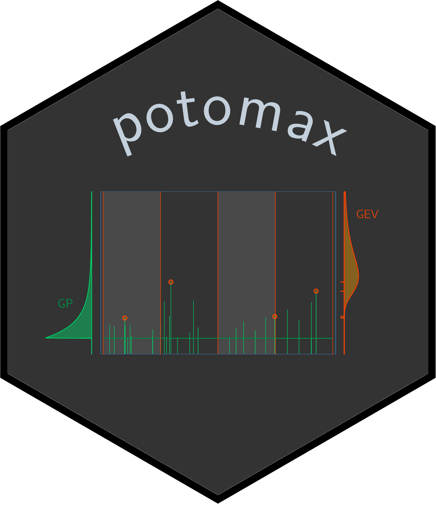

potomax README
================
Yves Deville



<!-- README.md is generated from README.Rmd. Please edit that file -->

# R package potomax

**potomax** is a R package financed by IRSN Behrig.

**potomax** is devoted to Extreme Value analysis and merges the two
classical approaches *POT* (Peaks Over Threshold) and *block MAXima*. In
both cases we may consider that the observations are related in some way
to a *Poisson-GP marked process* i.e., a marked Poisson process with the
marks following the Generalised Pareto (GP) distribution. While this
framework is classical for POT, it is also convenient for block maxima
with arbitrary block durations. This approach allows to censor the block
maxima that are too small to be considered as extreme, as is often
needed for one-year blocks. It also allows to cope with heterogeneous
data as met when using historical information.

For the standard case where the excesses follow the two-parameter GP
distribution, the model include the three parameters $\lambda$ (rate of
the Poisson process for the exceedances over the threshold $u$), and the
two GP parameters $\sigma$ (scale) and $\xi$ (shape). The vector of
parameters $\boldsymbol{\theta} = [\lambda, \, \sigma,\, \xi]^\top$ can
be transformed into the vector
$\boldsymbol{\theta}^\star = [\mu^\star, \, \sigma^\star, \,\xi^\star]^\top$
of so-called “Poisson-Process” (PP) parameters that describe the GEV
distribution of the maximum on a block with a fixed reference duration
$w^\star$, usually taken as one year. The PP parameters do not depend on
the threshold $u$ but they depend on $w^\star$. The Poisson-GP
parameters do not depend on $w^\star$ but depend on the threshold $u$.
The shape parameters $\xi$ and $\xi^\star$ are identical in the two
parameterisations. It is often simpler to use the Poisson-GP
parameterisation because the rate $\lambda$ can be concentrated out of
the likelihood.

While the Poisson-GP formulation was already implemented in the
**Renext** package, **potomax** puts emphasis on the use of
*profile-likelihood* inference rather than on the cheapest widespread
*delta method* that is used in **Renext**. The profile-likelihood
confidence intervals on the parameters and return levels are known to
have better coverage rate than those based on the delta method. However
the profile-likelihood inference requires to repeatedly solve
optimisation problems, with possible numerical issues. The derivatives
of the distribution functions w.r.t the parameters are provided to
facilitate the optimisation tasks. Graphical diagnostics are available
to check that the profile-likelihood results are correct.

The package provides classical S3 methods for fitted models such as
`summary`, `coef`, `logLik`, `confint`, … It also provides the methods
`RL` to compute Return Levels and their confidence intervals, and
`autoplot` method to produce “RL plots”.

# News

See the file [NEWS.md](NEWS.md).

# Install release version from GitHub

## Using the *remotes* package

For potomax versions \>= 0.2.3, in an R session simply use

``` r
library(remotes)
install_github("yvesdeville/potomax", dependencies = TRUE)
```

This should install the package and make it ready to use.

Note that the package comes with a *vignette* which by default will not
be built/installed. So it may be prefreable to use

``` r
library(remotes)
install_github("yvesdeville/potomax", dependencies = TRUE, build_vignettes = TRUE)
```

and a the package help will then give a link to the (html) vignette *R
Package potomax: Overview*.

You can also select a specific branch or a specific commit by using the
suitable syntax for `install_github`, see the **devtools** package
documentation. Mind that earlier versions contain compiled code hence
will require for Windows users that the Rtools have been installed.

## Clone, build and install

### Cloning the repository

If you do not have yet a local `potomax` repository, use `git clone` to
clone the `potomax` repository

``` bash
git clone https://github.com/yvesdeville/potomax
```

This will create a `potomax` sub-directory of the current directory,
i.e. the directory from which the git command was issued.

### Installation on Unix and MacOs systems

With these systems you can install a package from its source. Move to
the parent directory of your cloned repository and use the following
command from a terminal to create a tarball source file

``` bash
R CMD build potomax
```

This will produce a source tarball `potomax_x.y.z` where `x`, `y` and
`z` stand for the major, minor and patch version numbers. Then you can
install from a command line

``` bash
R CMD INSTALL potomax_x.y.z
```

Note that you must also have all the packages required by **potomax**
installed.

If you are using the **RStudio** IDE, you can alternatively use menus.
